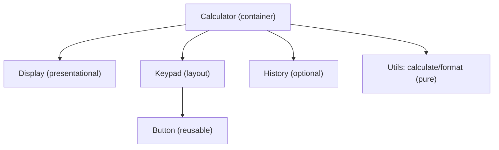

# Migration Guide: Converting a jQuery-based Calculator to React

## Table of Contents
- [1. Overview and Objectives](#1-overview-and-objectives)
- [2. Current State (jQuery) – Typical Patterns and Pain Points](#2-current-state-jquery--typical-patterns-and-pain-points)
- [3. Target Architecture (React)](#3-target-architecture-react)
- [4. Component Breakdown](#4-component-breakdown)
- [5. State Model and Reducer (example)](#5-state-model-and-reducer-example)
- [6. UX and Accessibility Improvements](#6-ux-and-accessibility-improvements)
- [7. Styling Approach](#7-styling-approach)
- [8. Error Handling and Edge Cases](#8-error-handling-and-edge-cases)
- [9. Testing Strategy](#9-testing-strategy)
- [10. Migration Steps](#10-migration-steps)
- [11. Performance Considerations](#11-performance-considerations)
- [12. Example File Structure](#12-example-file-structure)
- [13. De-risking and Rollout](#13-de-risking-and-rollout)
- [14. Acceptance Criteria](#14-acceptance-criteria)

## 1. Overview and Objectives
This guide explains how to migrate a jQuery-based calculator into a modern React application. The goal is to replace imperative DOM manipulation with declarative React components, introduce a clean component hierarchy with unidirectional data flow, and significantly improve usability and accessibility. The migration also adds development tooling, testing, and type-safety recommendations to ensure long-term maintainability and quality.

Objectives:
- Modernize the calculator UI and internal logic by moving from jQuery to React.
- Adopt a component-driven architecture with unidirectional data flow.
- Ensure accessibility alignment with WCAG AA, robust keyboard navigation, and responsive design.
- Add test coverage and development tooling for linting and formatting.

## 2. Current State (jQuery) – Typical Patterns and Pain Points
Legacy jQuery calculators generally rely on direct DOM selection and event binding. This approach often entangles UI elements with business logic, making the code harder to reason about and test.

Common issues:
- Imperative DOM updates via selectors and event handlers such as click and keypress.
- Global mutable state stored in variables within script scope, leading to implicit dependencies.
- Tight coupling between UI and business logic, making refactors risky.
- Hard-to-test behavior due to DOM-centric side effects rather than pure functions.
- Inconsistent input validation and error handling that is scattered across event handlers.

## 3. Target Architecture (React)
The React version follows a component-oriented design using functional components and hooks. State is centralized at the calculator container, with child components receiving props and callbacks.

Key elements:
- Functional components with hooks such as useState and useReducer.
- Component hierarchy:
  - Calculator: top-level container managing state and orchestrating operations.
  - Display: presents the current input, expression, and result.
  - Keypad: renders grouped Buttons for digits, operators, and actions.
  - Button: accessible, reusable button component.
  - History (optional): lists previous calculations for quick selection.
- State management options:
  - Simple: useState in Calculator to manage input, operator, and operands.
  - Complex: useReducer for robust operation handling, including undo/redo.
- Logic isolation:
  - A utility module for parsing and evaluating expressions.
  - Pure functions for calculator operations to simplify tests and reduce side effects.

### Architecture diagram (conceptual)


## 4. Component Breakdown
The components below reflect a clear separation of concerns, minimizing coupling and easing testability.

- Calculator
  - Responsibilities: Holds application state, handles events, delegates rendering to Display, Keypad, and History.
  - State: currentValue, previousValue, operator, expression, error, mode (e.g., theme).
  - Actions: inputDigit, inputDecimal, chooseOperator, evaluate, clear, delete.
  - Notes: Houses useState or useReducer depending on complexity needs.

- Display
  - Props: expression, currentValue, error.
  - Behavior: Renders an accessible live region to announce results and errors and prevents overflow by truncation or scrolling.

- Keypad
  - Props: callbacks for all actions and a layout configuration.
  - Behavior: Renders groups for Digits (0–9), Operators (+, −, ×, ÷), and Actions (C, =, ⌫). Provides keyboard bindings.

- Button
  - Props: label, value, onPress, variant, ariaLabel.
  - Behavior: Implements accessible roles and focus styles; respects Enter/Space activation and ARIA labels.

- History (optional)
  - Props: items, onSelectEntry.
  - Behavior: Displays previous calculations; use virtualization when the list grows for performance.

## 5. State Model and Reducer (example)
The reducer approach is recommended for complex flows, improving predictability and enabling undo/redo strategies. Represent current input as a string to accommodate leading zeros and precise decimal handling.

```typescript
type CalcState = {
  current: string;
  previous: string | null;
  operator: '+' | '-' | '×' | '÷' | null;
  error?: string | null;
};

type Action =
  | { type: 'digit'; payload: string }
  | { type: 'decimal' }
  | { type: 'operator'; payload: CalcState['operator'] }
  | { type: 'evaluate' }
  | { type: 'clear' }
  | { type: 'delete' };

function reducer(state: CalcState, action: Action): CalcState {
  // Implement pure transitions here (placeholder)
  return state;
}
```

Implementation notes:
- Use a string-based current value to handle leading zeros and decimals cleanly.
- Guard invalid sequences such as multiple decimals or multiple operators in a row.
- Normalize divide-by-zero to an error state and provide clear feedback to the user.

## 6. UX and Accessibility Improvements
Accessibility and UX should be first-class concerns for the React implementation, ensuring the calculator is usable by keyboard and assistive technologies.

- Keyboard navigation: The Tab order follows visual layout, with Enter/Space activating buttons. Map number and operator keys to actions for keyboard-first operation.
- Screen reader support: Use aria-pressed where appropriate, an aria-live region to announce result updates, and accessible labels for operators (e.g., “multiply” for ×).
- Focus management: Provide a visible focus ring and manage focus after Evaluate and Clear to maintain user context.
- Responsive layout: Use CSS Grid for the keypad and flexible units for the display. Ensure touch targets are at least 44px in both dimensions.
- Error messaging: Display an inline, non-blocking error banner with concise guidance and a recovery path.
- Animations: Use subtle transitions on button press and avoid distracting motion to maintain clarity and accessibility.
- Internationalization (optional): Use Intl for locale-aware number formatting.
- Theme support: Use CSS variables to implement light/dark and high-contrast modes.

## 7. Styling Approach
Adopt a modern styling approach with a tokenized system for consistency and theming.

- Use CSS Modules, Tailwind, or styled-components. Prefer tokens via CSS variables for easy theming.
- Layout the keypad with CSS Grid (4xN) and use Flexbox for the display bar for alignment and responsiveness.
- Define a color system using theme variables and ensure a contrast ratio of at least 4.5:1 for text against backgrounds.

## 8. Error Handling and Edge Cases
A reliable calculator must handle edge cases without crashing or confusing users.

- Divide by zero: Surface a clear error state and guidance to reset input.
- Multiple decimal points: Prevent entry of a second decimal in the current number.
- Long inputs and overflow: Truncate gracefully and allow horizontal scroll on the display.
- Operator replacement: Pressing an operator twice should replace the previous operator rather than stacking.
- Consecutive evaluations: Repeated equals should apply the last operation consistently.
- Negative numbers and +/- toggle (optional): Allow toggling sign to support negative values.

## 9. Testing Strategy
Testing ensures the migration preserves correctness and prevents regressions.

- Unit tests: Cover pure operation utilities (calculate.ts) and the reducer transitions.
- Component tests: Verify Display and Button rendering and interaction behavior.
- Integration tests: Simulate end-to-end flows such as digit → operator → digit → evaluate.
- Accessibility checks: Include automated checks using axe-core to detect common issues.
- Snapshot tests: Validate layout stability for components with stable rendering.

## 10. Migration Steps
These steps guide the transformation from a jQuery implementation to a React architecture.

1. Inventory current jQuery features, selectors, and event flows to map functionality one-to-one.
2. Extract core calculation logic into pure functions that are independent of the DOM.
3. Scaffold React components and routes if part of a larger SPA environment.
4. Implement the Calculator with useReducer and connect it to Display, Keypad, and Button.
5. Replace direct DOM manipulation with React state updates via dispatched actions and props.
6. Add accessibility attributes, keyboard bindings, and aria-live regions to improve usability.
7. Apply the chosen styling system and verify responsiveness across common breakpoints.
8. Write and run tests, targeting at least 80% coverage for utilities and essential components.
9. Remove jQuery dependencies and dead code once parity is achieved and verified.
10. Perform user acceptance testing (UAT), resolve defects, and finalize documentation.

## 11. Performance Considerations
The calculator is UI-driven and generally lightweight, but you should still optimize rendering and data flow.

- Keep state minimal and colocated. Memoize derived values when necessary.
- Use React.memo for Button and other stable presentational components to reduce re-renders.
- Defer heavy computations and debounce any free-form input if introduced.
- Code-split the History panel if it grows complex or introduces heavy dependencies.

## 12. Example File Structure
A recommended structure using TypeScript and clearly separated concerns:

```
src/
  components/
    Calculator/
      Calculator.tsx
      reducer.ts
      types.ts
    Display/Display.tsx
    Keypad/Keypad.tsx
    Button/Button.tsx
    History/History.tsx
  utils/
    calculate.ts
    format.ts
  styles/
    tokens.css
    global.css
  tests/
    calculate.test.ts
    reducer.test.ts
```

Recommendations:
- TypeScript is recommended for correctness and maintainability.
- Keep utilities pure and framework-agnostic to enable easy testing.

## 13. De-risking and Rollout
To minimize risk, release the React calculator alongside the legacy version under a feature flag.

- Feature flag the React calculator to allow A/B validation with real users.
- Collect telemetry on errors and usage patterns to validate parity and improvements.
- Keep the legacy build available for one release to enable quick rollback if necessary.

## 14. Acceptance Criteria
A successful migration should meet the following criteria:

- All jQuery references are removed and no jQuery bundle remains in the output.
- The calculator supports digits, decimals, addition, subtraction, multiplication, division, clear, delete, and equals.
- The UI supports keyboard-first operation and is screen-reader friendly.
- The layout is responsive and touch-friendly with adequate target sizes.
- The test suite passes with target coverage and automated accessibility checks.
- The architecture is documented, and component APIs are clear and stable.
